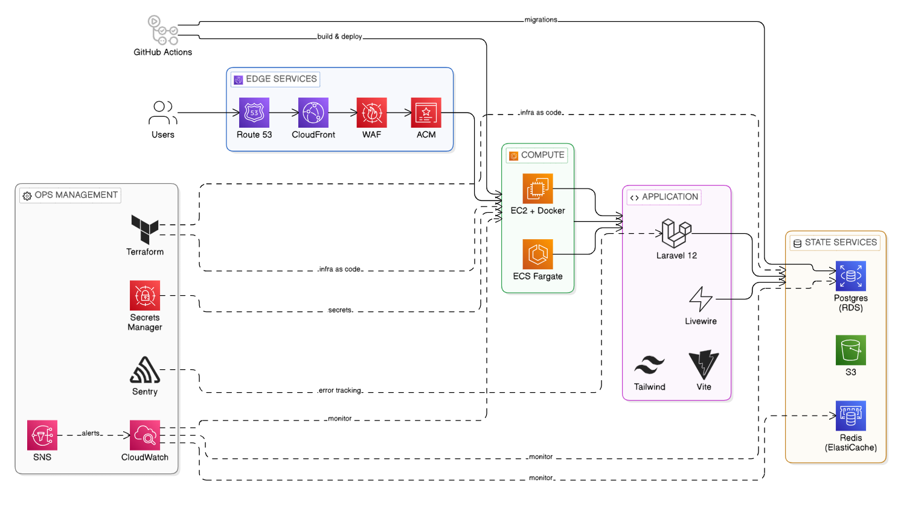
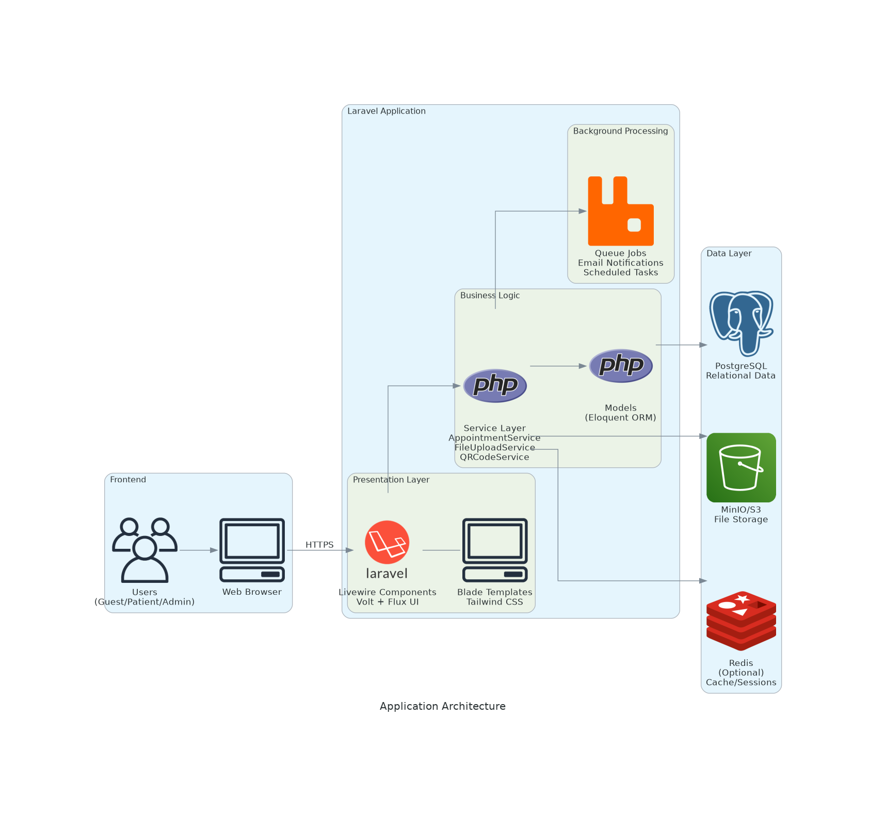
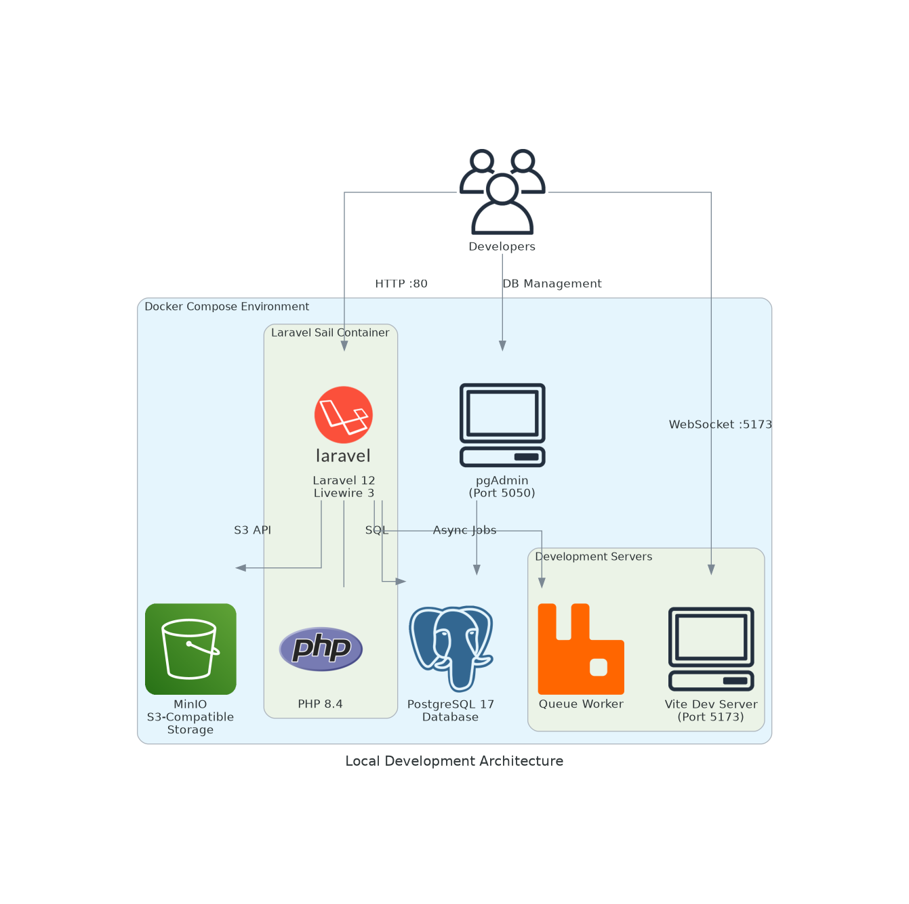
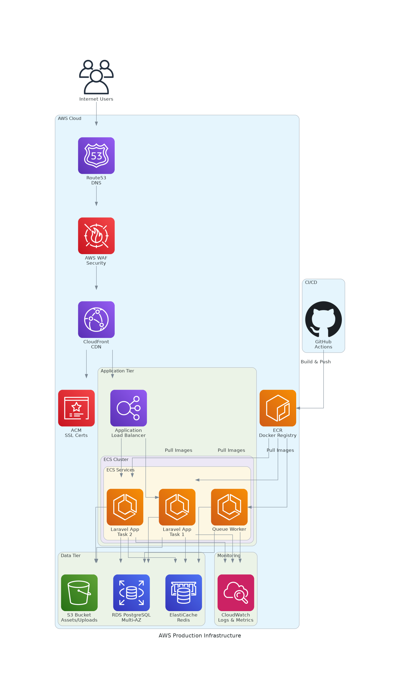
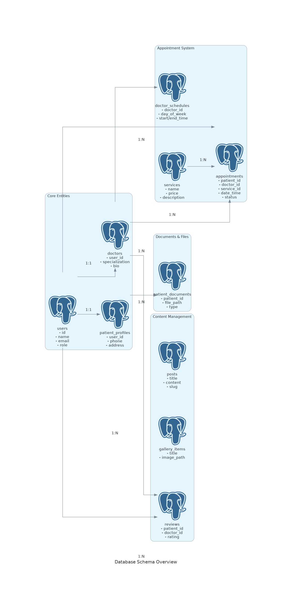

# 🏥 Dentistry Website - Modern Dental Clinic Management System

[](https://laravel.com)
[](https://livewire.laravel.com)
[](https://www.postgresql.org)
[](https://www.docker.com)
[](https://aws.amazon.com)
[](LICENSE)

A **production-ready**, **cloud-native** dental clinic management system built with **Laravel 12**, **Livewire 3**, and **PostgreSQL 17**. This comprehensive web application provides complete solutions for appointment scheduling, patient records management, doctor profiles, service catalog, content management, and more.



## ✨ Overview

This is an enterprise-grade dental clinic management platform featuring:

- 🎯 **Smart Appointment System** with real-time availability checking
- 👥 **Role-Based Access Control** (Guest, Patient, Doctor, Admin)
- 📱 **Responsive Design** optimized for all devices
- 🔐 **Security First** with 2FA support and comprehensive authorization
- ⚡ **Real-Time Updates** powered by Livewire
- 🌍 **Multi-Language Support** (Vietnamese & English)
- ☁️ **Cloud-Ready** with Docker and AWS infrastructure support

## 📑 Table of Contents

- [Quick Start](#-quick-start)
- [Architecture Overview](#-architecture-overview)
  - [Application Architecture](#application-architecture)
  - [Local Development Infrastructure](#local-development-infrastructure)
  - [AWS Production Infrastructure](#aws-production-infrastructure)
  - [Database Schema](#database-schema)
- [Tech Stack](#️-tech-stack)
- [Key Features](#-key-features)
- [User Roles](#-user-roles)
- [Project Structure](#-project-structure)
- [Development Commands](#-development-commands)
- [Testing](#-testing)
- [Infrastructure Setup](#-infrastructure-setup)
  - [Docker Compose Services](#docker-compose-services)
  - [Container Architecture](#container-architecture)
  - [Network Configuration](#network-configuration)
- [Database Seeding](#-database-seeding)
- [Default Credentials](#-default-credentials)
- [Environment Variables](#-environment-variables)
- [Deployment](#-deployment)
  - [Local Development](#local-development)
  - [AWS Production Deployment](#aws-production-deployment)
  - [CI/CD Pipeline](#cicd-pipeline)
- [Troubleshooting](#-troubleshooting)
- [Contributing](#-contributing)
- [License](#-license)

## 🚀 Quick Start

### Prerequisites

Make sure you have the following installed on your system:

- **PHP** 8.2 or higher
- **Composer** 2.x
- **Node.js** 18.x or higher & NPM
- **Docker** & **Docker Compose** (for containerized setup)
- **PostgreSQL** 17 (if running locally without Docker)

### Installation

#### Option 1: Using Docker (Recommended)

```bash
# 1. Clone the repository
git clone https://github.com/vietviet08/dentistry-wp.git
cd dentistry-wp

# 2. Install PHP dependencies
composer install

# 3. Install Node dependencies
npm install

# 4. Environment setup
cp .env.example .env
php artisan key:generate

# 5. Start Docker services (PostgreSQL + pgAdmin + MinIO)
./vendor/bin/sail up -d
# Or if you don't have Sail alias:
docker compose up -d

# 6. Run database migrations with seeding
./vendor/bin/sail artisan migrate --seed

# 7. Link storage for file uploads
./vendor/bin/sail artisan storage:link

# 8. Start development servers using composer script
composer run dev
# This will start Laravel server, queue worker, and Vite dev server concurrently
```

#### Option 2: Local Development (Without Docker)

```bash
# 1. Clone the repository
git clone https://github.com/vietviet08/dentistry-wp.git
cd dentistry-wp

# 2. Install dependencies
composer install
npm install

# 3. Environment setup
cp .env.example .env
php artisan key:generate

# 4. Configure database (edit .env file)
# Update DB_HOST=localhost (or your PostgreSQL host)
# Set DB_DATABASE, DB_USERNAME, DB_PASSWORD accordingly

# 5. Run migrations
php artisan migrate --seed

# 6. Link storage
php artisan storage:link

# 7. Start development servers in separate terminals
# Terminal 1 - Laravel server
php artisan serve

# Terminal 2 - Vite dev server
npm run dev

# Terminal 3 - Queue worker (for email notifications)
php artisan queue:work
```

## 🔗 Access URLs

- **Application**: http://localhost
- **pgAdmin**: http://localhost:5050 (admin@admin.com / admin)
- **PostgreSQL**: localhost:5432
- **MinIO Console**: http://localhost:9001 (minioadmin / minioadmin)
- **MinIO API**: http://localhost:9000

## 🏗️ Architecture Overview

### Application Architecture

The application follows a modern layered architecture built on Laravel's MVC pattern with Livewire components for real-time interactivity.



**Architecture Layers:**

1. **Presentation Layer** - Livewire components with Volt functional API and Flux UI components
2. **Business Logic Layer** - Service classes handling core business operations
3. **Data Layer** - Eloquent ORM models with PostgreSQL database
4. **Background Processing** - Queue-based jobs for asynchronous tasks
5. **Storage Layer** - MinIO S3-compatible object storage for files and images

### Local Development Infrastructure

The local development environment runs entirely in Docker containers using Laravel Sail, providing a consistent development experience across all platforms.



**Key Components:**

- **Laravel Sail Container**: Main application container running PHP 8.4 with Laravel 12
- **PostgreSQL 17**: Primary relational database with persistent volumes
- **pgAdmin**: Web-based database management interface
- **MinIO**: S3-compatible object storage for local development
- **Vite Dev Server**: Hot module replacement for frontend assets
- **Queue Worker**: Background job processing for email notifications

### AWS Production Infrastructure

The production environment leverages AWS managed services for high availability, scalability, and security.



**Infrastructure Components:**

1. **Edge Layer**
   - **Route53**: DNS management with health checks
   - **CloudFront**: Global CDN for low-latency content delivery
   - **WAF**: Web Application Firewall for security
   - **ACM**: SSL/TLS certificate management

2. **Application Layer**
   - **Application Load Balancer**: Distributes traffic across ECS tasks
   - **ECS Cluster**: Containerized application deployment with auto-scaling
   - **ECR**: Docker container registry for application images

3. **Data Layer**
   - **RDS PostgreSQL**: Multi-AZ database with automated backups
   - **ElastiCache Redis**: In-memory caching and session management
   - **S3**: Object storage for user uploads and static assets

4. **Monitoring & Operations**
   - **CloudWatch**: Centralized logging and metrics
   - **SNS**: Alert notifications
   - **CloudWatch Alarms**: Automated monitoring and alerting

5. **CI/CD**
   - **GitHub Actions**: Automated testing and deployment
   - **ECR**: Container image storage and versioning

### Database Schema

The database schema is optimized for dental clinic operations with clear entity relationships and normalized structure.



**Core Entities:**

- **Users**: Authentication and role management (patient, doctor, admin)
- **Doctors**: Doctor profiles with specializations and qualifications
- **Patient Profiles**: Patient information and medical details
- **Appointments**: Booking system with status tracking
- **Doctor Schedules**: Time slot management for availability
- **Services**: Treatment catalog with pricing
- **Reviews**: Patient feedback and ratings system
- **Posts**: Blog/CMS content management
- **Gallery Items**: Before/after photos showcase
- **Patient Documents**: Secure file storage for medical records

**Key Relationships:**
- One-to-One: User ↔ Doctor, User ↔ Patient Profile
- One-to-Many: Doctor → Appointments, Doctor → Schedules, Doctor → Reviews
- Many-to-One: Appointment → Patient, Appointment → Doctor, Appointment → Service

## 🛠️ Tech Stack

### Backend Framework & Core
- **Laravel 12** - Modern PHP web framework with latest features
- **Livewire 3** - Full-stack reactive framework for dynamic interfaces
- **Volt** - Functional programming API for Livewire components
- **Laravel Fortify** - Authentication backend with 2FA support
- **PHP 8.4** - Latest PHP with performance improvements and type system

### Frontend Technologies
- **Tailwind CSS 4** - Utility-first CSS framework with Vite integration
- **Flux UI** - Premium Laravel UI component library
- **Vite 7** - Next-generation frontend build tool with HMR
- **Alpine.js** - Lightweight JavaScript framework for interactivity
- **ApexCharts** - Modern charting library for dashboard analytics

### Database & Storage
- **PostgreSQL 17** - Advanced relational database with ACID compliance
- **MinIO** - High-performance S3-compatible object storage
- **Database Queue** - Laravel queue driver using database tables
- **Redis** (Optional) - In-memory data store for caching and sessions

### DevOps & Infrastructure
- **Docker & Docker Compose** - Container orchestration for development
- **Laravel Sail** - Light-weight command-line interface for Docker
- **pgAdmin** - Web-based PostgreSQL administration tool
- **Terraform** - Infrastructure as Code for AWS deployment
- **GitHub Actions** - CI/CD automation for testing and deployment

### Cloud Services (AWS Production)
- **Amazon ECS** - Container orchestration service (Fargate)
- **Amazon RDS** - Managed PostgreSQL with Multi-AZ support
- **Amazon ElastiCache** - Managed Redis cluster
- **Amazon S3** - Object storage for static assets and uploads
- **Amazon CloudFront** - Global CDN for content delivery
- **Amazon Route53** - Scalable DNS and domain management
- **AWS WAF** - Web application firewall
- **Amazon ECR** - Docker container registry
- **Amazon CloudWatch** - Monitoring, logging, and alerting

### Testing & Quality Assurance
- **PestPHP** - Modern PHP testing framework with elegant syntax
- **Mockery** - Powerful mocking library for unit tests
- **Laravel Pint** - Opinionated PHP code formatter (PSR-12)
- **PHPUnit** - Unit testing framework

### Additional Libraries & Tools
- **Intervention Image** - Image manipulation and processing
- **Spatie Laravel Sitemap** - Automatic XML sitemap generation
- **League Flysystem** - Filesystem abstraction layer
- **Composer** - PHP dependency management
- **NPM** - JavaScript package management
- **Concurrently** - Run multiple commands concurrently for development

## 📦 Key Features

### Authentication & Security
- 🔐 Multi-factor authentication (2FA) with Laravel Fortify
- 👥 Role-based access control (Guest, Patient, Admin)
- 🔒 Secure password hashing and session management

### Appointment Management
- 📅 Smart appointment booking system with real-time availability
- ⏰ Automated appointment reminders via email
- 📊 Appointment status tracking (pending, confirmed, completed, cancelled)
- 🗓️ Calendar view for managing appointments

### Doctor Management
- 👨‍⚕️ Doctor profiles with specializations and qualifications
- 📅 Flexible schedule management with time slots
- ⭐ Patient reviews and ratings system
- 📈 Performance analytics

### Patient Services
- 📝 Complete medical records and history
- 💳 Online appointment booking
- 📧 Email notifications for appointments
- ⭐ Review and rating system for doctors and services

### Content Management
- 📰 Blog/CMS with WYSIWYG editor
- 🖼️ Gallery management for before/after photos
- 🦷 Service catalog with detailed descriptions
- 📄 Dynamic page content management

### Technical Features
- 🔍 SEO optimized with auto-generated sitemaps
- 📧 Queue-based email notifications
- 🗄️ S3-compatible object storage (MinIO)
- 📱 Responsive design with Tailwind CSS
- ⚡ Real-time updates with Livewire
- 📊 Dashboard with analytics and charts

## 👥 User Roles

- **Guest**: Browse services, doctors, blog
- **Patient**: Book appointments, view history, write reviews
- **Admin**: Full system management

## 📂 Project Structure

```
├─ app/
│  ├─ Livewire/          # Livewire components
│  ├─ Models/            # Database models
│  ├─ Policies/          # Authorization policies
│  └─ Services/          # Business logic
├─ database/
│  ├─ migrations/        # Database migrations
│  └─ seeders/           # Test data seeders
├─ resources/
│  ├─ views/livewire/    # Livewire/Volt views
│  ├─ css/              # Styles
│  └─ js/               # JavaScript
└─ routes/
   └─ web.php           # Application routes
```

## 🔧 Development Commands

```bash
# Code formatting with Laravel Pint
./vendor/bin/pint

# Run tests
php artisan test
# or using composer
composer test

# Clear all caches
php artisan optimize:clear

# Generate sitemap
php artisan sitemap:generate

# Run scheduler (cron jobs)
php artisan schedule:run

# Watch queue for jobs
php artisan queue:work

# List all routes
php artisan route:list

# Fresh database with seeding
php artisan migrate:fresh --seed
```

## 🧪 Testing

```bash
# Run all tests
php artisan test

# Run specific test file
php artisan test tests/Feature/AppointmentTest.php

# Run tests with coverage
php artisan test --coverage

# Run tests in parallel
php artisan test --parallel
```

## 🏗️ Infrastructure Setup

### Docker Compose Services

The application uses Docker Compose to orchestrate multiple containerized services for local development. All services are configured in `compose.yaml`.

#### Service Breakdown

**1. Laravel Application Container (`laravel.test`)**
- **Base Image**: Sail PHP 8.4 runtime
- **Ports**: 
  - `80` - HTTP web server
  - `5173` - Vite development server
- **Purpose**: Main application server running Laravel, PHP-FPM, and Nginx
- **Volumes**: Mounts project directory to `/var/www/html`
- **Dependencies**: PostgreSQL, MinIO

**2. PostgreSQL Database (`pgsql`)**
- **Image**: `postgres:17-alpine`
- **Port**: `5432`
- **Purpose**: Primary relational database for application data
- **Features**:
  - Persistent data storage using Docker volumes
  - Health checks for container orchestration
  - Automatic test database creation
  - Alpine-based for smaller footprint
- **Volume**: `sail-pgsql` - Persistent database storage

**3. pgAdmin (`pgadmin`)**
- **Image**: `dpage/pgadmin4:latest`
- **Port**: `5050`
- **Purpose**: Web-based database administration and query tool
- **Features**:
  - Visual query builder
  - Database schema explorer
  - SQL editor with syntax highlighting
  - Pre-configured server connection via `pgadmin-servers.json`
- **Access**: http://localhost:5050 (admin@admin.com / admin)

**4. MinIO Object Storage (`minio`)**
- **Image**: `minio/minio:latest`
- **Ports**:
  - `9000` - S3-compatible API endpoint
  - `9001` - Web-based management console
- **Purpose**: S3-compatible object storage for files, images, and documents
- **Features**:
  - Compatible with AWS S3 SDK
  - Built-in web console for bucket management
  - Suitable for local development and testing
- **Volume**: `minio_data` - Persistent file storage
- **Access**: 
  - Console: http://localhost:9001 (minioadmin / minioadmin)
  - API: http://localhost:9000

### Container Architecture

```
┌─────────────────────────────────────────────────────────────┐
│                    Docker Network: sail                      │
│                                                               │
│  ┌──────────────┐      ┌──────────────┐      ┌───────────┐ │
│  │   Laravel    │─────▶│  PostgreSQL  │◀─────│  pgAdmin  │ │
│  │   (Sail)     │      │      :5432   │      │   :5050   │ │
│  │   :80, :5173 │      └──────────────┘      └───────────┘ │
│  └──────┬───────┘              │                             │
│         │                      │                             │
│         │              ┌───────▼────────┐                    │
│         └─────────────▶│     MinIO      │                    │
│                        │  :9000, :9001  │                    │
│                        └────────────────┘                    │
└─────────────────────────────────────────────────────────────┘
```

### Network Configuration

All services communicate through a Docker bridge network named `sail`, providing:
- **Service Discovery**: Services can reference each other by service name (e.g., `pgsql`, `minio`)
- **Isolation**: Network traffic isolated from host machine
- **Port Mapping**: Selected ports exposed to host for external access

### Volume Management

**Persistent Volumes:**
- `sail-pgsql` - PostgreSQL database files
- `sail-pgadmin` - pgAdmin configuration and settings
- `minio_data` - MinIO object storage files

**Bind Mounts:**
- Project root → `/var/www/html` (application code)
- `pgadmin-servers.json` → `/pgadmin4/servers.json` (pre-configured database connection)

### Environment Configuration

Key environment variables for container orchestration:

```bash
# Application Ports
APP_PORT=80              # Laravel HTTP port
VITE_PORT=5173           # Vite dev server port
PGADMIN_PORT=5050        # pgAdmin web interface port
MINIO_PORT=9000          # MinIO API port
MINIO_CONSOLE_PORT=9001  # MinIO console port

# Database Configuration
DB_HOST=pgsql            # Database host (service name)
DB_PORT=5432
DB_DATABASE=dentistry
DB_USERNAME=postgres
DB_PASSWORD=secret

# MinIO/S3 Configuration
FILESYSTEM_DISK=minio    # or 'local' for filesystem storage
AWS_ENDPOINT=http://minio:9000
AWS_BUCKET=dentistry
AWS_USE_PATH_STYLE_ENDPOINT=true
```

### Container Health Monitoring

**PostgreSQL Health Check:**
```yaml
healthcheck:
  test: ["CMD", "pg_isready", "-q", "-d", "dentistry", "-U", "postgres"]
  retries: 3
  timeout: 5s
```

This ensures dependent services wait for PostgreSQL to be ready before starting.

### Resource Requirements

**Minimum System Requirements:**
- **CPU**: 2 cores
- **RAM**: 4GB (8GB recommended)
- **Disk**: 10GB free space
- **Docker**: 20.x or higher
- **Docker Compose**: 2.x or higher

**Production Recommendations:**
- **CPU**: 4+ cores
- **RAM**: 16GB+
- **Disk**: SSD with 50GB+ free space

### Development Workflow

The Docker setup supports efficient development workflows:

1. **Code Changes**: Auto-synced via bind mounts (no container restart needed)
2. **Hot Module Replacement**: Vite dev server provides instant frontend updates
3. **Database Migrations**: Run directly in container: `./vendor/bin/sail artisan migrate`
4. **Queue Processing**: Automatic queue worker in concurrent dev mode
5. **Log Viewing**: `./vendor/bin/sail logs -f` for real-time log streaming

### Infrastructure as Code (Terraform)

For production AWS deployment, the `infrastructure/` directory contains:

- **Terraform Modules**: Reusable infrastructure components
  - `networking` - VPC, subnets, security groups, load balancers
  - `compute` - ECS cluster, task definitions, services
  - `database` - RDS PostgreSQL with Multi-AZ
  - `storage` - S3 buckets with lifecycle policies
  - `cache` - ElastiCache Redis cluster
  - `edge` - Route53, CloudFront, WAF, ACM certificates
  - `monitoring` - CloudWatch dashboards, alarms, SNS topics

- **Environment Configurations**: Separate configs for staging/production
- **Backend State Management**: S3 + DynamoDB for Terraform state locking
- **Secret Management**: AWS Secrets Manager integration

See [infrastructure/DEPLOYMENT.md](infrastructure/DEPLOYMENT.md) for complete deployment guide.

## 📊 Database Seeding

```bash
# Seed all data
php artisan db:seed

# Seed specific seeder
php artisan db:seed --class=ServiceSeeder
php artisan db:seed --class=DoctorSeeder
```

## 🔐 Default Credentials (after seeding)

**Admin Account:**
- Email: admin@dentistry.test
- Password: password

**Test Patient:**
- Email: patient@dentistry.test
- Password: password

⚠️ **Important**: Change these credentials in production!

## 🌍 Environment Variables

Key environment variables you should configure:

```bash
# Application
APP_NAME=Dentistry
APP_ENV=local
APP_DEBUG=true
APP_URL=http://localhost

# Database (PostgreSQL)
DB_CONNECTION=pgsql
DB_HOST=pgsql                    # or localhost for local setup
DB_PORT=5432
DB_DATABASE=dentistry
DB_USERNAME=postgres
DB_PASSWORD=secret

# Mail Configuration
MAIL_MAILER=smtp                 # Use 'log' for development
MAIL_HOST=smtp.mailtrap.io
MAIL_PORT=2525
MAIL_USERNAME=null
MAIL_PASSWORD=null
MAIL_FROM_ADDRESS=hello@dentistry.com
MAIL_FROM_NAME="${APP_NAME}"

# Storage (MinIO/S3)
FILESYSTEM_DISK=local            # or 'minio' for S3-compatible storage
AWS_ACCESS_KEY_ID=minioadmin
AWS_SECRET_ACCESS_KEY=minioadmin
AWS_DEFAULT_REGION=us-east-1
AWS_BUCKET=dentistry
AWS_ENDPOINT=http://minio:9000
AWS_USE_PATH_STYLE_ENDPOINT=true

# Queue
QUEUE_CONNECTION=database        # or 'redis' for better performance

# Cache
CACHE_STORE=database             # or 'redis' for production
```

## 🚀 Deployment

### Local Development

For local development setup, see the [Quick Start](#-quick-start) section above.

### AWS Production Deployment

#### Prerequisites

1. **AWS Account** with appropriate IAM permissions
2. **Domain Name** configured and ready
3. **AWS CLI** installed and configured
4. **Terraform** >= 1.0 installed
5. **Docker** installed for local image building
6. **GitHub** repository with Actions enabled

#### Initial Infrastructure Setup

**1. Configure AWS Credentials**

```bash
aws configure
# Enter: Access Key ID, Secret Access Key, Region (e.g., ap-southeast-1)
```

**2. Create Terraform Backend Storage**

```bash
# Create S3 bucket for Terraform state
aws s3 mb s3://dentistry-terraform-state --region ap-southeast-1
aws s3api put-bucket-versioning \
    --bucket dentistry-terraform-state \
    --versioning-configuration Status=Enabled

# Create DynamoDB table for state locking
aws dynamodb create-table \
    --table-name terraform-state-lock \
    --attribute-definitions AttributeName=LockID,AttributeType=S \
    --key-schema AttributeName=LockID,KeyType=HASH \
    --provisioned-throughput ReadCapacityUnits=5,WriteCapacityUnits=5 \
    --region ap-southeast-1
```

**3. Initialize Terraform**

```bash
cd infrastructure/terraform/environments/production
terraform init
terraform plan  # Review planned changes
terraform apply # Create infrastructure
```

This creates:
- VPC with public/private subnets
- Application Load Balancer
- ECS cluster and services
- RDS PostgreSQL (Multi-AZ)
- ElastiCache Redis cluster
- S3 buckets for storage
- CloudFront distribution
- Route53 hosted zone
- ECR container registry
- CloudWatch monitoring and alarms

**4. Configure Secrets**

Store sensitive data in AWS Secrets Manager:

```bash
# Database credentials
aws secretsmanager create-secret \
    --name dentistry/production/database \
    --secret-string '{"username":"dentistry_admin","password":"SECURE_PASSWORD","host":"rds-endpoint","port":5432,"database":"dentistry"}'

# Application key
aws secretsmanager create-secret \
    --name dentistry/production/app-key \
    --secret-string 'base64:YOUR_GENERATED_APP_KEY'
```

**5. Build and Deploy Application**

```bash
# Authenticate with ECR
aws ecr get-login-password --region ap-southeast-1 | \
    docker login --username AWS --password-stdin \
    ACCOUNT_ID.dkr.ecr.ap-southeast-1.amazonaws.com

# Build Docker image
docker build -t dentistry:latest .

# Tag and push to ECR
ECR_REPO=$(terraform output -raw ecr_repository_url)
docker tag dentistry:latest $ECR_REPO:latest
docker push $ECR_REPO:latest

# Update ECS service
CLUSTER_NAME=$(terraform output -raw ecs_cluster_name)
SERVICE_NAME=$(terraform output -raw ecs_service_name)
aws ecs update-service \
    --cluster $CLUSTER_NAME \
    --service $SERVICE_NAME \
    --force-new-deployment
```

**6. Run Database Migrations**

```bash
# Execute one-time migration task
aws ecs run-task \
    --cluster $CLUSTER_NAME \
    --task-definition $TASK_DEFINITION \
    --launch-type FARGATE \
    --overrides '{"containerOverrides":[{"name":"app","command":["php","artisan","migrate","--force"]}]}'
```

**7. Configure DNS**

Update your domain's nameservers to Route53:

```bash
terraform output route53_name_servers
# Update at your domain registrar
```

### CI/CD Pipeline

GitHub Actions automates the deployment process:

**Workflow Triggers:**
- Push to `main` branch → Deploy to production
- Push to `develop` branch → Deploy to staging
- Pull requests → Run tests only

**Pipeline Steps:**
1. **Checkout Code** - Clone repository
2. **Setup PHP & Dependencies** - Install Composer packages
3. **Setup Node.js** - Install NPM packages
4. **Run Tests** - Execute PestPHP test suite
5. **Build Assets** - Compile frontend with Vite
6. **Build Docker Image** - Create production container
7. **Push to ECR** - Upload to container registry
8. **Update ECS Service** - Deploy new version with rolling update
9. **Run Migrations** - Update database schema if needed
10. **Verify Deployment** - Health check validation
11. **Notify Team** - Slack/Email deployment notification

**Manual Deployment:**
1. Go to GitHub Actions tab
2. Select "Deploy to AWS" workflow
3. Click "Run workflow"
4. Choose environment (production/staging)
5. Confirm deployment

### Production Checklist

Before deploying to production:

- [ ] Set `APP_ENV=production` and `APP_DEBUG=false`
- [ ] Generate new `APP_KEY` with `php artisan key:generate`
- [ ] Configure production database credentials in Secrets Manager
- [ ] Set up SMTP provider (SendGrid, SES, etc.) for email
- [ ] Configure S3 bucket or MinIO for file storage
- [ ] Set up Redis for cache and queue (via ElastiCache)
- [ ] Configure SSL certificate in ACM
- [ ] Set up cron job for Laravel scheduler:
  ```bash
  * * * * * cd /var/www/html && php artisan schedule:run >> /dev/null 2>&1
  ```
- [ ] Configure Supervisor for queue workers:
  ```ini
  [program:dentistry-worker]
  process_name=%(program_name)s_%(process_num)02d
  command=php /var/www/html/artisan queue:work --sleep=3 --tries=3
  autostart=true
  autorestart=true
  user=www-data
  numprocs=2
  redirect_stderr=true
  stdout_logfile=/var/www/html/storage/logs/worker.log
  ```
- [ ] Run `composer install --optimize-autoloader --no-dev`
- [ ] Run `npm ci && npm run build` for production assets
- [ ] Run optimization commands:
  ```bash
  php artisan config:cache
  php artisan route:cache
  php artisan view:cache
  php artisan event:cache
  ```
- [ ] Set proper file permissions:
  ```bash
  chmod -R 775 storage bootstrap/cache
  chown -R www-data:www-data storage bootstrap/cache
  ```
- [ ] Configure CloudWatch alarms for monitoring
- [ ] Set up automated database backups (RDS configured by Terraform)
- [ ] Configure WAF rules for security
- [ ] Enable Multi-AZ for RDS (production only)

### Deployment Commands Reference

```bash
# Production deployment (via GitHub Actions)
git checkout main
git pull origin main
git merge develop
git push origin main

# Manual production build
composer install --optimize-autoloader --no-dev
npm ci
npm run build
php artisan config:cache
php artisan route:cache
php artisan view:cache

# Database migrations (production)
php artisan migrate --force

# Generate sitemap
php artisan sitemap:generate

# Clear all caches (if needed)
php artisan optimize:clear

# Restart queue workers
php artisan queue:restart

# View deployment logs
aws logs tail /ecs/dentistry-production --follow
```

### Monitoring & Operations

**CloudWatch Dashboards:**
- Application metrics (CPU, memory, request count)
- Database performance (connections, query time)
- Cache hit rates
- Error rates and 5xx responses

**Alarms Configured:**
- High CPU utilization (>80%) → Scale up
- High memory utilization (>90%) → Scale up
- Database connection errors → Notify team
- 5xx error rate threshold → Notify team
- Low RDS storage space → Notify team

**Log Groups:**
- `/ecs/dentistry-production` - Application logs
- `/aws/rds/instance/dentistry-prod-db/error` - Database errors
- `/aws/elasticache/dentistry-redis` - Cache logs

**Auto-Scaling:**
- Based on CPU (target: 70%) and Memory (target: 80%)
- Min instances: 2, Max instances: 10
- Scale-out cooldown: 60 seconds
- Scale-in cooldown: 300 seconds

### Rollback Procedures

**Application Rollback:**
```bash
# List previous task definitions
aws ecs list-task-definitions --family-prefix dentistry-production-app

# Rollback to previous version
aws ecs update-service \
    --cluster $CLUSTER_NAME \
    --service $SERVICE_NAME \
    --task-definition dentistry-production-app:PREVIOUS_REVISION
```

**Database Rollback:**
```bash
# Restore from automated backup
aws rds restore-db-instance-from-db-snapshot \
    --db-instance-identifier dentistry-rollback \
    --db-snapshot-identifier dentistry-manual-YYYYMMDD
```

### Backup Strategy

**Database Backups:**
- Automated daily backups (7-day retention)
- Manual snapshots before major changes
- Multi-AZ with synchronous replication
- Point-in-time recovery enabled

**Application Data:**
- S3 versioning enabled for uploaded files
- Lifecycle policies: IA after 30 days, Glacier after 90 days

**Disaster Recovery:**
- RTO (Recovery Time Objective): 4 hours
- RPO (Recovery Point Objective): 1 hour
- Cross-region replication for critical S3 buckets (optional)

## 🐛 Troubleshooting

### Common Issues

**Issue: Docker services won't start**
```bash
# Solution: Remove old containers and volumes
docker compose down -v
docker compose up -d
```

**Issue: Permission denied errors**
```bash
# Solution: Fix storage and cache permissions
sudo chmod -R 775 storage bootstrap/cache
sudo chown -R $USER:www-data storage bootstrap/cache
```

**Issue: Class not found errors**
```bash
# Solution: Regenerate autoloader
composer dump-autoload
```

**Issue: Database connection refused**
```bash
# Solution: Check if PostgreSQL is running
docker compose ps
# or for local setup
sudo systemctl status postgresql
```

**Issue: Vite dev server not working**
```bash
# Solution: Clear node modules and reinstall
rm -rf node_modules package-lock.json
npm install
npm run dev
```

**Issue: Queue jobs not processing**
```bash
# Solution: Restart queue worker
php artisan queue:restart
php artisan queue:work
```

**Issue: MinIO connection errors**
```bash
# Solution: Check MinIO is running and create bucket
docker compose ps
# Access MinIO console at http://localhost:9001
# Login with minioadmin/minioadmin and create 'dentistry' bucket
```

## 📝 License

Private project - All rights reserved

## 📚 Additional Documentation

For more detailed information, please refer to:

- **[SYSTEM_SPECIFICATION.md](SYSTEM_SPECIFICATION.md)** - Complete system architecture, database schema, API documentation, and implementation details
- **[infrastructure/README.md](infrastructure/README.md)** - Infrastructure as Code documentation
- **[infrastructure/DEPLOYMENT.md](infrastructure/DEPLOYMENT.md)** - Comprehensive deployment guide with AWS setup
- **[infrastructure/RUNBOOKS.md](infrastructure/RUNBOOKS.md)** - Operational runbooks and troubleshooting procedures

## 🤝 Contributing

This is a private project, but if you're part of the team:

1. Fork the repository
2. Create a feature branch (`git checkout -b feature/amazing-feature`)
3. Commit your changes (`git commit -m 'Add some amazing feature'`)
4. Push to the branch (`git push origin feature/amazing-feature`)
5. Open a Pull Request

### Code Style

- Follow PSR-12 coding standards
- Use Laravel Pint for code formatting: `./vendor/bin/pint`
- Write meaningful commit messages
- Add tests for new features
- Update documentation as needed

### Development Workflow

1. Pull latest changes from master
2. Create a new branch for your feature
3. Make changes and test locally
4. Run tests: `php artisan test`
5. Format code: `./vendor/bin/pint`
6. Commit and push changes
7. Create a pull request with description

## 📞 Support

For issues, questions, or contributions:
- Create an issue in the repository
- Contact the development team

## 🙏 Acknowledgments

Built with:

**Core Framework & Tools:**
- [Laravel](https://laravel.com) - The PHP Framework for Web Artisans
- [Livewire](https://livewire.laravel.com) - A full-stack framework for dynamic interfaces
- [Volt](https://livewire.laravel.com/docs/volt) - Functional programming API for Livewire
- [Flux UI](https://flux.laravel.com) - Premium UI components for Laravel

**Frontend Technologies:**
- [Tailwind CSS](https://tailwindcss.com) - Utility-first CSS framework
- [Alpine.js](https://alpinejs.dev) - Lightweight JavaScript framework
- [Vite](https://vitejs.dev) - Next-generation frontend tooling

**Database & Storage:**
- [PostgreSQL](https://www.postgresql.org) - The world's most advanced open source database
- [MinIO](https://min.io) - High-performance S3-compatible object storage
- [Redis](https://redis.io) - In-memory data structure store

**DevOps & Infrastructure:**
- [Docker](https://www.docker.com) - Containerization platform
- [Laravel Sail](https://laravel.com/docs/sail) - Light-weight CLI for Docker development
- [Terraform](https://www.terraform.io) - Infrastructure as Code tool
- [GitHub Actions](https://github.com/features/actions) - CI/CD automation
- [Amazon Web Services](https://aws.amazon.com) - Cloud computing platform

**Development Tools:**
- [pgAdmin](https://www.pgadmin.org) - PostgreSQL administration tool
- [Composer](https://getcomposer.org) - Dependency manager for PHP
- [PestPHP](https://pestphp.com) - Elegant PHP testing framework
- [Laravel Pint](https://laravel.com/docs/pint) - PHP code style fixer

---

**For detailed system specifications and architecture**, see [SYSTEM_SPECIFICATION.md](SYSTEM_SPECIFICATION.md)

**Made with ❤️ for modern dental clinics**

